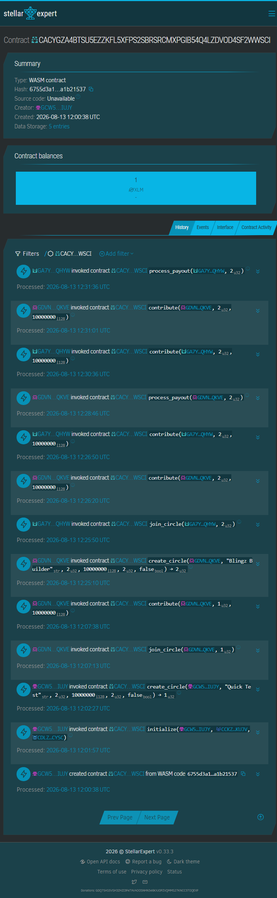
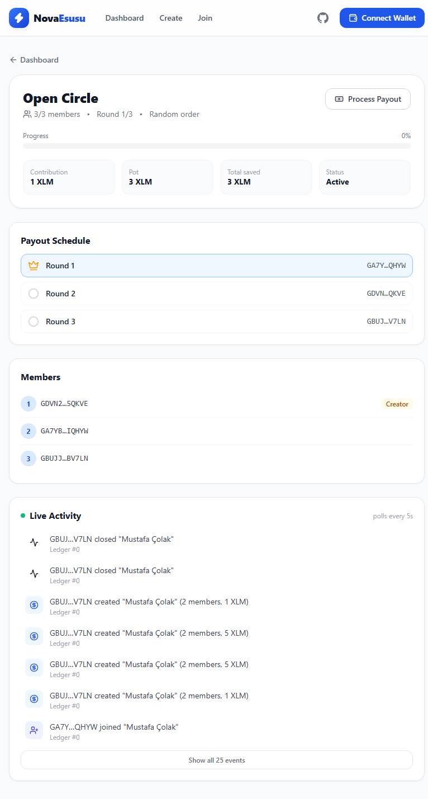
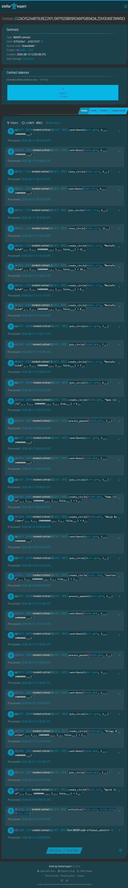

# Nova Esusu — Trustless Rotating Savings on Stellar

> **Save together. Rotate payouts. Build reputation.**

Nova Esusu brings the centuries-old African rotating savings system (Esusu / Ajo / Adashe) on-chain. Members contribute XLM into a shared pool each round, and one member receives the full pot on a rotating basis — all enforced by smart contracts, with zero intermediaries.

## Why Esusu?

40+ million Africans participate in rotating savings groups (Esusu in Nigeria, Ajo in Ghana, Stokvel in South Africa). These informal systems suffer from:

- **No transparency** — members can't verify who paid what
- **Default risk** — recipients who take the pot and disappear
- **No recourse** — no reputation system, no accountability
- **Geographic lock** — you can only join circles with people you physically know

Nova Esusu solves all four on Stellar: **sub-cent transaction fees**, **cross-border participation**, and **on-chain reputation tracking**.

## What Makes Nova Esusu Different

Unlike single-contract savings apps, Nova Esusu uses a **two-contract architecture** with cross-contract calls:

| Feature | Nova Esusu | Typical Savings DApp |
|---|---|---|
| **Contracts** | 2 (SavingsPool + MemberManager) | 1 |
| **Reputation System** | ✅ On-chain score per member | ❌ |
| **Default Penalty** | ✅ Automated reputation deduction | ❌ |
| **Eligibility Gating** | ✅ Low-reputation members blocked | ❌ |
| **Cross-Contract Calls** | ✅ Pool ↔ Manager communication | ❌ |

### The Reputation Advantage

Every member starts with a reputation score of 100. Contributing on time increases it. Defaulting decreases it. Circles can require a minimum reputation to join — so serial defaulters are naturally excluded from the ecosystem. This creates a **trust layer** that traditional Esusu groups rely on social pressure to enforce.

## Architecture

```
┌─────────────────────────────────────────────────────────────┐
│                     React Frontend (Vercel)                  │
│  Dashboard · Circle Detail · Create · Contribute · Live Feed │
└──────────────────────┬──────────────────────────┬───────────┘
                       │                          │
           ┌───────────▼──────────┐   ┌───────────▼──────────┐
           │   SavingsPool        │   │   MemberManager       │
           │   (Escrow Engine)    │   │   (Reputation Layer)  │
           │                      │   │                       │
           │  • create_circle     │   │  • register_member    │
           │  • join_circle       │──►│  • check_eligibility  │
           │  • contribute        │   │  • update_reputation  │
           │  • process_payout    │   │  • track_reputation   │
           │  • close_circle      │   │  • invite_member      │
           │  • handle_default    │──►│                       │
           └──────────────────────┘   └───────────────────────┘
                    │
           ┌────────▼─────────┐
           │   Native XLM SAC  │
           │   (Stellar Asset  │
           │    Contract)      │
           └──────────────────┘
```

**Cross-contract flow:** When a member joins a circle, SavingsPool calls `MemberManager.check_eligibility()`. When a member defaults, SavingsPool calls `MemberManager.update_reputation()` to penalize them automatically.

## Smart Contracts

| Contract | Address (Testnet) | Purpose |
|---|---|---|
| **SavingsPool** | `CACYGZA4BTSU5EZZKFL5XFPS2SBRSRCMXPGIB54Q4LZDVOD4SF2WWSCI` | Escrow, contributions, payouts, rotation, close |
| **MemberManager** | `CCKZ7BEZ2FIKJT7FJMMG452CPQM66UABMLNMDYC6IJGB5R2LQ6GQKUJV` | Member registration, reputation, eligibility |

### Deployer
- Identity: `ubongdeployer4`
- Address: `GCW5Q5X2KOZRUUT2A6V54SIHLPKA3BD3HGXEGKSRI6E5EGPPT4EVIUJY`

## Screenshots

| Desktop Dashboard | Mobile Dashboard | Create Circle | Join Circle |
|---|---|---|---|
|  |  |  |  |

### On-Chain Analytics

| Contract Activity (Stellar Expert) |
|---|
|  |

### Real User Activity (Testnet)

Circle #6 "Open Circle" — created with 2 seed members and 1 open slot, filled by an external tester. On activation the contract shuffled and locked a random payout order; all 3 members contributed on-chain via their own wallets.

| Active Circle — 3/3 members, random payout order locked | External tester's live activity on-chain |
|---|---|
|  |  |

**Distinct wallets that have interacted with the contract: 8 total — 6 external testers.** Each joined, contributed, and/or created circles via their own wallets; the contract's **first-ever payout went to an external tester**, and 3 of them also submitted written feedback via the [form](#user-feedback). Verifiable on [Stellar Expert](https://stellar.expert/explorer/testnet/contract/CACYGZA4BTSU5EZZKFL5XFPS2SBRSRCMXPGIB54Q4LZDVOD4SF2WWSCI) — every create, join, contribution, and payout is public on-chain.

| # | Tester | Wallet | First seen | On-chain activity | Feedback |
|---|---|---|---|---|---|
| 1 | narrivex | `GCDLL…7R2M` | Aug 17 | created circles | — |
| 2 | [Mustafa Çolak](https://github.com/mustafaColak0) | `GBUJ…V7LN` | Aug 17 | joined + contributed, circle owner | ✅ 5/5 |
| 3 | Nomet | `GA35…63GO` | Aug 18 | joined circle #7, created circle #13, **received its first payout** | ✅ 5/5 |
| 4 | Vansh Dhiwar | `GC4L…EMZJ` | Aug 18 | created circle #14 | ✅ 5/5 |
| 5 | Blingz Kim | `GA7Y…QHYW` | Aug 17 | joined circles #6/#12/#14, received the contract's **first-ever payout**, contributed Round 2 | ✅ 5/5 |
| 6 | *(tester via Edge)* | `GA2U…KW4S` | Aug 19 | joined circle #10 after pushing through two UX blockers — both fixed mid-session | — |

## Features

- **Create Circles** — Set size, contribution amount, cycle count, and payout order (sequential or randomized)
- **Join Circles** — Eligibility-checked via MemberManager reputation
- **Close Circles** — Creator can soft-delete pending circles before activation
- **Contribute** — One-click XLM contribution with real-time transaction status
- **Automated Payouts** — Full pot rotates to each member in sequence
- **Reputation System** — On-chain scoring rewards reliable members
- **Default Handling** — Automatic penalty for non-contributors
- **Live Event Feed** — Real-time on-chain activity via Soroban events
- **Multi-Wallet Support** — Freighter, Albedo, xBull via Stellar Wallets Kit
- **Mobile-First Design** — Responsive across all devices

## Tech Stack

| Layer | Technology |
|---|---|
| Smart Contracts | Rust + Soroban SDK 22 |
| Frontend | React 18 + TypeScript + Vite 5 |
| Styling | TailwindCSS 3 |
| Wallet | `@creit.tech/stellar-wallets-kit` v2.5.0 |
| Blockchain | `@stellar/stellar-sdk` v16 (Soroban RPC) |
| Testing | Vitest (35+ test cases) |
| CI/CD | GitHub Actions |
| Deployment | Vercel |

## Quick Start

### Prerequisites
- [Rust](https://rustup.rs/) with `wasm32v1-none` target
- [Stellar CLI](https://github.com/stellar/stellar-cli) v22+
- Node.js 20+
- [Freighter](https://freighter.app/) wallet extension

### Build Contracts
```bash
cd contracts
stellar contract build
cargo check
```

### Run Frontend
```bash
cd frontend
npm install
npm run dev
```

### Run Tests
```bash
cd frontend
npm test
```

## Project Structure

```
nova-esusu/
├── contracts/
│   ├── shared/           # Shared types + cross-contract client traits
│   │   └── src/lib.rs
│   ├── member_manager/   # Reputation + eligibility contract
│   │   └── src/lib.rs
│   └── savings_pool/     # Escrow + payout engine contract
│       └── src/lib.rs
├── frontend/
│   ├── src/
│   │   ├── components/   # UI components (Header, CircleCard, ContributeModal, etc.)
│   │   ├── hooks/        # React hooks (useWallet, useCircles, useEvents)
│   │   ├── lib/          # Config, contract client, wallet, utils
│   │   └── pages/        # Dashboard, CircleDetail, CreateCircle
│   ├── tests/            # Vitest test suites
│   └── public/demo/      # Pitch deck
├── .github/workflows/    # CI/CD pipeline
├── DEPLOYMENT.md         # Testnet deployment records
├── vercel.json           # Vercel deployment config
└── LICENSE               # MIT License
```

## Roadmap

| Phase | Status | Goal |
|---|---|---|
| **MVP (Testnet)** | ✅ Live | Two contracts + frontend + 10 users |
| **Growth (Testnet)** | 🔄 Next | 50 users + feedback iteration + pitch deck |
| **Mainnet Launch** | 📋 Planned | Security audit + mainnet deploy + real adoption |
| **Ecosystem Growth** | 📋 Planned | 500+ users + cross-border anchor integration |

## Demo Video

🎬 **[Watch the full demo](https://drive.google.com/file/d/1EipemcUbbxi5-cyi2YLdB1ON1slGSZrd/view?usp=sharing)** — connect wallet → create circle → join → contribute → payout, all on Stellar testnet with real Freighter transactions.

## Pitch Deck

📊 **[View the pitch deck](https://stellar-nova-esusu.vercel.app/demo/pitch-deck.html)** — problem, solution, market opportunity, architecture, traction, growth strategy, and roadmap.

## User Feedback

We collect user feedback via Google Forms — name, email, wallet address, and product ratings — and export all responses to Excel for analysis.

**📋 [Share your feedback](https://docs.google.com/forms/d/e/1FAIpQLSdjiD6qvZ7PcJe6h82sILmBKIQdoWW7Na8vGviGdoLiZ5Ijew/viewform?usp=publish-editor)** — takes 2 minutes.

### Collected Responses (Excel)

📥 **[Download all feedback responses (.xlsx)](docs/feedback/nova-esusu-feedback-2026-08-19.xlsx)** — 4 responses to date.

**Results snapshot:** every tester rated **5/5** across all categories — wallet connection ease, transaction speed, and escrow security. Zero bugs reported by testers. Feature requests received: dark theme (shipped), interactive onboarding guide (shipped), auto-contribute, payout-turn notifications, savings-history dashboard, CSV transaction export.

*Wallet addresses in the responses are verifiable on [Stellar Expert](https://stellar.expert/explorer/testnet/contract/CACYGZA4BTSU5EZZKFL5XFPS2SBRSRCMXPGIB54Q4LZDVOD4SF2WWSCI) — every response maps to real on-chain activity.*

### Feedback-Driven Iteration

Every round of user feedback produces a shipped improvement. Here's what changed:

| User Feedback | Improvement Shipped | Commit |
|---|---|---|
| "The platform concept is a bit hard to grasp for first-time users" — [Mustafa Çolak](https://github.com/mustafaColak0), feedback form | Full onboarding layer: first-visit 4-step welcome modal (with wallet-connect CTA + friendbot faucet link), permanent How-it-works section on the dashboard, Guide link in the nav to re-open anytime | [`ec228e0`](https://github.com/ubongn/stellar-nova-esusu/commit/ec228e0) |
| "Dark theme plsssss" — Nomet, external tester (feedback form) | Full dark mode: class-based theme across every surface, header toggle (sun/moon), persisted choice, OS-preference default, zero-flash pre-paint script | [`738684d`](https://github.com/ubongn/stellar-nova-esusu/commit/738684d) |
| Navbar felt heavy in dark mode | Transparent navbar at rest, elevated surface + shadow on scroll | [`3ebbb2d`](https://github.com/ubongn/stellar-nova-esusu/commit/3ebbb2d) |
| "Once a transaction is confirmed, the modal should close / button stay disabled" — Ubong (dogfooding) | Contribute modal locks after on-chain confirmation + auto-closes after showing success state; only a failed tx re-enables retry | [`5943537`](https://github.com/ubongn/stellar-nova-esusu/commit/5943537) |
| "Activity feed stretches the page as events accumulate" | Scrollable Live Activity feed (in-card, max-height, thin scrollbar) | [`4fad3b4`](https://github.com/ubongn/stellar-nova-esusu/commit/4fad3b4) |
| "Translating the page into Turkish causes a white-screen crash (insertBefore error)" + "create-form summary shows stale values" — [Mustafa Çolak](https://github.com/mustafaColak0), external tester | Root-caused both symptoms to Chrome auto-translate mutating the DOM under React; disabled page translation (`translate="no"` + notranslate meta). Any non-English browser no longer crashes the app. | [`6298daf`](https://github.com/ubongn/stellar-nova-esusu/commit/6298daf) |
| "Hard to find circles — I only know the name, not the ID" | Unified search: query by circle ID **or** name; name results render as clickable cards | [`058bbde`](https://github.com/ubongn/stellar-nova-esusu/commit/058bbde) |
| "Activity feed is too long / cluttered" | LiveEventFeed collapsed to 20 events (6 in compact mode) with Show all / Show less toggle | [`26d1758`](https://github.com/ubongn/stellar-nova-esusu/commit/26d1758) |
| Crash on joining a circle from search results | Fixed undefined `circleId` reference in preview navigation | [`f90651f`](https://github.com/ubongn/stellar-nova-esusu/commit/f90651f) |
| Testers couldn't see the product story | Added demo video to README + deduplicated feedback section | [`8dca100`](https://github.com/ubongn/stellar-nova-esusu/commit/8dca100) |

### Next Phase Improvements (from feedback pipeline)

Based on early feedback themes, the next iteration focuses on:

1. **Payout-turn awareness** — "push notifications when it's my turn to receive the pot" (Blingz Kim). Planned: event subscription + email/Telegram alerts.
2. **Auto-contribute** — opt-in automatic contribution when a round opens (Blingz Kim).
3. **Savings history dashboard** — per-wallet contribution/payout history export (Blingz Kim, Mustafa).
4. **Clearer error messages** — human-readable failure states for every tx path (Blingz Kim).
5. **Mobile experience** — Freighter is desktop-only. Planned: Albedo sign-in support for mobile testers.

These will ship with commit links added to the table above as they land.

## License

[MIT License](LICENSE) — Copyright © 2026 Ubong Ntekim

---

Built for the [Stellar Journey to Mastery](https://www.risein.com) challenge on [Rise In](https://risein.com).
