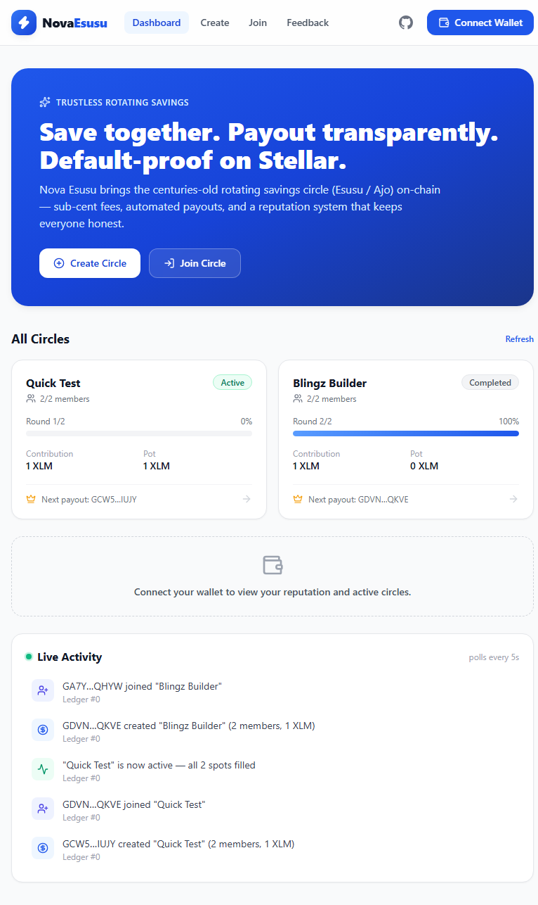
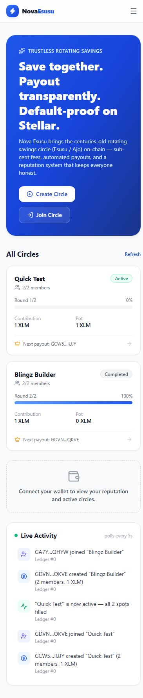
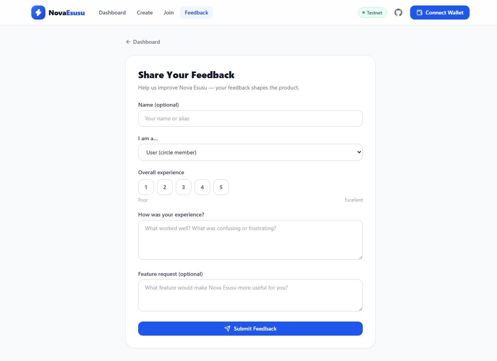
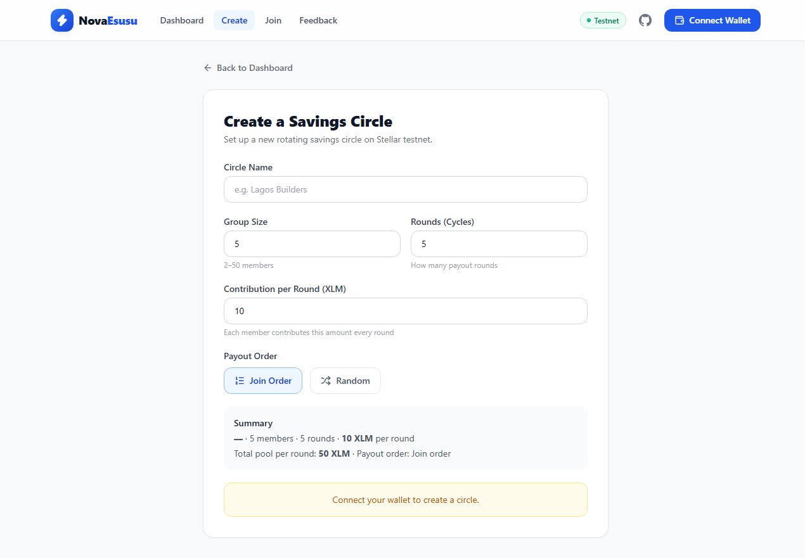
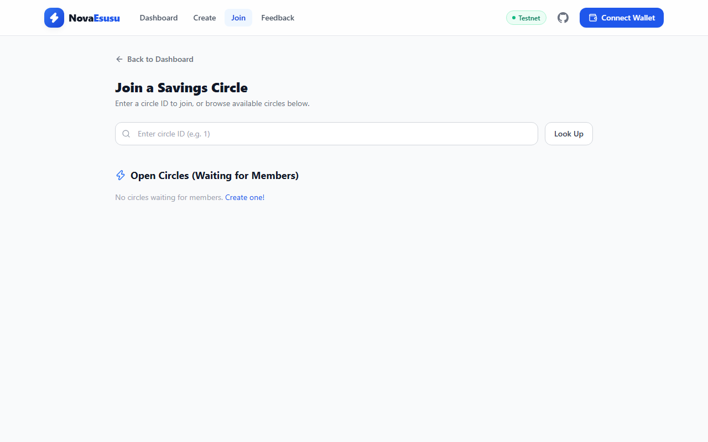

# Nova Esusu — Trustless Rotating Savings on Stellar

> **Save together. Rotate payouts. Build reputation.**

Nova Esusu brings the centuries-old African rotating savings system (Esusu / Ajo / Adashe) on-chain. Members contribute XLM into a shared pool each round, and one member receives the full pot on a rotating basis — all enforced by smart contracts, with zero intermediaries.

## Why Esusu?

40+ million Africans participate in rotating savings groups (Esusu in Nigeria, Ajo in Ghana, Stokvel in South Africa). These informal systems suffer from:

- **No transparency** — members can't verify who paid what
- **Default risk** — recipients who take the pot and disappear
- **No recourse** — no reputation system, no accountability
- **Geographic lock** — you can only join circles with people you physically know

Nova Esusu solves all four on Stellar: **sub-cent transaction fees**, **cross-border participation**, and **on-chain reputation tracking**.

## What Makes Nova Esusu Different

Unlike single-contract savings apps, Nova Esusu uses a **two-contract architecture** with cross-contract calls:

| Feature | Nova Esusu | Typical Savings DApp |
|---|---|---|
| **Contracts** | 2 (SavingsPool + MemberManager) | 1 |
| **Reputation System** | ✅ On-chain score per member | ❌ |
| **Default Penalty** | ✅ Automated reputation deduction | ❌ |
| **Eligibility Gating** | ✅ Low-reputation members blocked | ❌ |
| **Cross-Contract Calls** | ✅ Pool ↔ Manager communication | ❌ |

### The Reputation Advantage

Every member starts with a reputation score of 100. Contributing on time increases it. Defaulting decreases it. Circles can require a minimum reputation to join — so serial defaulters are naturally excluded from the ecosystem. This creates a **trust layer** that traditional Esusu groups rely on social pressure to enforce.

## Architecture

```
┌─────────────────────────────────────────────────────────────┐
│                     React Frontend (Vercel)                  │
│  Dashboard · Circle Detail · Create · Contribute · Live Feed │
└──────────────────────┬──────────────────────────┬───────────┘
                       │                          │
           ┌───────────▼──────────┐   ┌───────────▼──────────┐
           │   SavingsPool        │   │   MemberManager       │
           │   (Escrow Engine)    │   │   (Reputation Layer)  │
           │                      │   │                       │
           │  • create_circle     │   │  • register_member    │
           │  • join_circle       │──►│  • check_eligibility  │
           │  • contribute        │   │  • update_reputation  │
           │  • process_payout    │   │  • track_reputation   │
           │  • close_circle      │   │  • invite_member      │
           │  • handle_default    │──►│                       │
           └──────────────────────┘   └───────────────────────┘
                    │
           ┌────────▼─────────┐
           │   Native XLM SAC  │
           │   (Stellar Asset  │
           │    Contract)      │
           └──────────────────┘
```

**Cross-contract flow:** When a member joins a circle, SavingsPool calls `MemberManager.check_eligibility()`. When a member defaults, SavingsPool calls `MemberManager.update_reputation()` to penalize them automatically.

## Smart Contracts

| Contract | Address (Testnet) | Purpose |
|---|---|---|
| **SavingsPool** | `CACYGZA4BTSU5EZZKFL5XFPS2SBRSRCMXPGIB54Q4LZDVOD4SF2WWSCI` | Escrow, contributions, payouts, rotation, close |
| **MemberManager** | `CCKZ7BEZ2FIKJT7FJMMG452CPQM66UABMLNMDYC6IJGB5R2LQ6GQKUJV` | Member registration, reputation, eligibility |

### Deployer
- Identity: `ubongdeployer4`
- Address: `GCW5Q5X2KOZRUUT2A6V54SIHLPKA3BD3HGXEGKSRI6E5EGPPT4EVIUJY`

## Screenshots

| Desktop Dashboard | Mobile Dashboard | Feedback Form |
|---|---|---|
|  |  |  |

| Create Circle | Join Circle |
|---|---|
|  |  |

## Features

- **Create Circles** — Set size, contribution amount, cycle count, and payout order (sequential or randomized)
- **Join Circles** — Eligibility-checked via MemberManager reputation
- **Close Circles** — Creator can soft-delete pending circles before activation
- **Contribute** — One-click XLM contribution with real-time transaction status
- **Automated Payouts** — Full pot rotates to each member in sequence
- **Reputation System** — On-chain scoring rewards reliable members
- **Default Handling** — Automatic penalty for non-contributors
- **Live Event Feed** — Real-time on-chain activity via Soroban events
- **Multi-Wallet Support** — Freighter, Albedo, xBull via Stellar Wallets Kit
- **Mobile-First Design** — Responsive across all devices

## Tech Stack

| Layer | Technology |
|---|---|
| Smart Contracts | Rust + Soroban SDK 22 |
| Frontend | React 18 + TypeScript + Vite 5 |
| Styling | TailwindCSS 3 |
| Wallet | `@creit.tech/stellar-wallets-kit` v2.5.0 |
| Blockchain | `@stellar/stellar-sdk` v16 (Soroban RPC) |
| Testing | Vitest (35+ test cases) |
| CI/CD | GitHub Actions |
| Deployment | Vercel |

## Quick Start

### Prerequisites
- [Rust](https://rustup.rs/) with `wasm32v1-none` target
- [Stellar CLI](https://github.com/stellar/stellar-cli) v22+
- Node.js 20+
- [Freighter](https://freighter.app/) wallet extension

### Build Contracts
```bash
cd contracts
stellar contract build
cargo check
```

### Run Frontend
```bash
cd frontend
npm install
npm run dev
```

### Run Tests
```bash
cd frontend
npm test
```

## Project Structure

```
nova-esusu/
├── contracts/
│   ├── shared/           # Shared types + cross-contract client traits
│   │   └── src/lib.rs
│   ├── member_manager/   # Reputation + eligibility contract
│   │   └── src/lib.rs
│   └── savings_pool/     # Escrow + payout engine contract
│       └── src/lib.rs
├── frontend/
│   ├── src/
│   │   ├── components/   # UI components (Header, CircleCard, ContributeModal, etc.)
│   │   ├── hooks/        # React hooks (useWallet, useCircles, useEvents)
│   │   ├── lib/          # Config, contract client, wallet, utils
│   │   └── pages/        # Dashboard, CircleDetail, CreateCircle
│   ├── tests/            # Vitest test suites
│   └── public/demo/      # Pitch deck
├── .github/workflows/    # CI/CD pipeline
├── DEPLOYMENT.md         # Testnet deployment records
├── vercel.json           # Vercel deployment config
└── LICENSE               # MIT License
```

## Roadmap

| Phase | Status | Goal |
|---|---|---|
| **MVP (Testnet)** | ✅ Live | Two contracts + frontend + 10 users |
| **Growth (Testnet)** | 🔄 Next | 50 users + feedback iteration + pitch deck |
| **Mainnet Launch** | 📋 Planned | Security audit + mainnet deploy + real adoption |
| **Ecosystem Growth** | 📋 Planned | 500+ users + cross-border anchor integration |

## User Feedback

This project collects user feedback through an embedded Google Form. Feedback is analyzed and used to iterate on the product. See the feedback section in the live app.

## License

[MIT License](LICENSE) — Copyright © 2026 Ubong Ntekim

---

Built for the [Stellar Journey to Mastery](https://www.risein.com) challenge on [Rise In](https://risein.com).
